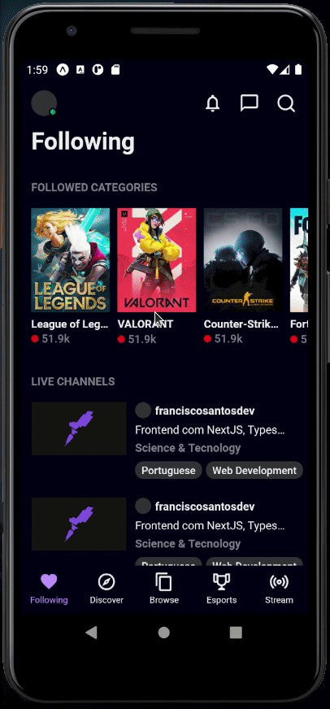

# TwitchTV clone

Clone da tela inicial do aplicativo TwitchTV feito com React Native usando Expo

# Rodando localmente

É necessário ter o ambiente para react-native configurado. Você pode configurar [seguindo este guia](https://react-native.rocketseat.dev/).

1 - `yarn install`

2 - Execute `yarn start` para iniciar o app
